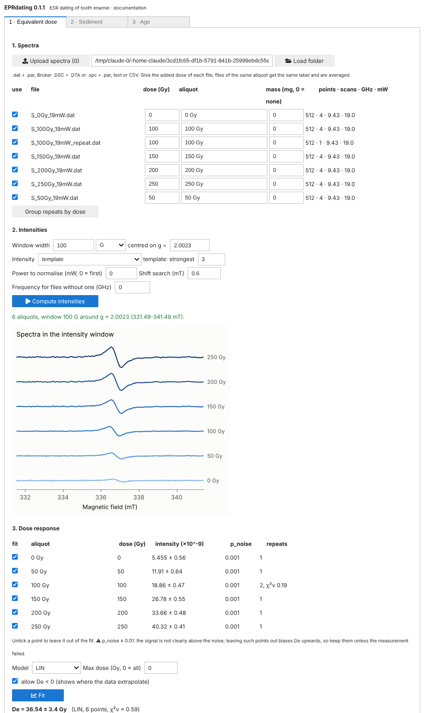

# EPRdating user guide

From raw measurements to an ESR age in three steps: the equivalent dose from
the EPR spectra, the sediment dose rate from gamma spectrometry, and the age
with its Monte Carlo uncertainty. Each step can be used on its own.

```bash
pip install eprdating                # core (numpy, scipy)
pip install "eprdating[plot]"        # + matplotlib, for the figures
pip install "eprdating[spectra]"     # + EPRAYA, for simulated line shapes
pip install "eprdating[gamma-formats]"  # + Canberra .cnf, ORTEC .spc, IEC 61455 gamma files
```

Units everywhere: field in mT, frequency in GHz, dose in Gy, dose rate in
Gy/ka, age in ka, U and Th in µg/g (ppm), K in %. Any input can be a number,
a `(value, sigma)` tuple or a `Value`.

### Interface (no code)

In Jupyter or Google Colab:

```python
%pip install "eprdating[gui]"
from eprdating.gui import app
a = app()
a
```

Three tabs. **Equivalent dose**: upload the spectra (or give a folder), set
the added dose of each file and give the same aliquot label to repeated
measurements, choose the intensity window, method and template, compute,
untick points if needed, choose the model and fit. **Sediment**: upload the
HPGe spectra, check the roles guessed from the file names (sample,
background, IAEA references), give the masses and the water content, and
analyse. **Age**: the De and the sediment arrive from the other tabs; fill
the tooth and site and compute the nominal and Monte Carlo ages. Each tab
has a *Prepare downloads* button for its results and its settings (JSON),
which record every choice. The panels are also objects (`a.de`, `a.gamma`,
`a.age`) that can be driven from code.



---

## 1. Equivalent dose from EPR spectra

### Reading spectra

```python
from eprdating.spectra import read_epr
s = read_epr("M18_3_19mW_4SCAN.dat")     # or .DSC/.DTA, .par/.spc, .csv
s.B, s.scans, s.y                        # field (mT), scans, scan average
s.freq_GHz, s.power_mW, s.gain, s.mod_amp_mT, s.time_constant_ms
```

| Files | Instrument / software |
|---|---|
| `.DSC` + `.DTA` | Bruker BES3T (Xepr: E500, E580, EMXplus, EMXmicro) |
| `.par` + `.spc` | Bruker ESP300 / WinEPR (EMX, ECS106) |
| `.dat` + `.par` | `KEY : value` parameters + five-column ASCII (UNAL X band) |
| `.txt` / `.csv` | a field column and one or more signal columns |

Bruker readers follow EasySpin's `eprload` and are checked on its test files.
Anything else can be loaded by hand: `Spectrum(B=..., scans=y[None, :])`.

### Intensity window

Every intensity is computed inside an `IntensityWindow`. The default is
**100 G (10 mT) centred on g = 2.0023**; the centre field is computed from each
spectrum's own microwave frequency (336.49 mT at 9.43 GHz), so the same window
works at any frequency. Width, unit and centre can be changed:

```python
from eprdating.spectra import IntensityWindow, DEFAULT_WINDOW

DEFAULT_WINDOW                                  # 100 G around g = 2.0023
IntensityWindow(60)                             # 60 G around g = 2.0023
IntensityWindow(8, unit="mT", center_g=2.0006)  # 8 mT around another g
IntensityWindow(80, center_mT=337.1)            # fixed centre field
DEFAULT_WINDOW.describe(9.43)                   # '100 G around g = 2.0023 (331.49-341.49 mT)'
```

The window should hold the whole dating signal plus a margin for the
baseline. The sweep **outside** the window is taken as signal-free: after a
polynomial baseline it gives the noise used for the errors, so it must be at
least as long as the window on one side (the UNAL 50 mT sweeps leave about
20 mT on each side). A wider window may take in other radicals (native
signal, CO3⁻, SO2⁻, methyl) that the intensity method does not describe; a
narrower one leaves few points for the baseline. `peak_to_peak` and
`double_integral` accept the same window (`window=DEFAULT_WINDOW, freq_GHz=...`).

### Intensities

Weak dating signals are best measured by fitting a line-shape template rather
than by peak-to-peak heights or double integrals of noisy spectra.

```python
from eprdating.spectra import intensity

r = intensity(s, template=(B_t, y_t), ref_power_mW=19.0)   # window=DEFAULT_WINDOW
r.value, r.sigma, r.window_mT, r.shift_mT
intensity(s, "peak_to_peak"), intensity(s, "t1_b2"), intensity(s, "double_integral")
```

* `template`: an empirical average of the strongest spectra
  (`aligned_average`), a simulation (`eprdating.spectra.epraya_backend`,
  broadened with `pseudo_modulation` and `time_constant_filter`), as a
  `(B, shape)` pair or a function of the field.
* `ref_power_mW` normalises to that microwave power (square-root law) and to
  unit receiver gain; `mass_mg=` divides by the aliquot mass.
* The template fit has a linear baseline (`baseline_order`) and searches a
  common field shift within `max_shift` (0.6 mT): tuning or frequency drift
  between measurements.
* Errors come from noise injection: blocks of the signal-free noise of the
  same spectrum are added to the fitted (or measured) spectrum and the
  intensity is recomputed. This accounts for the noise correlation of the
  time constant and for the shift search, for every method.

**Is there a signal at all?** A template fit that searches the field
position finds, in pure noise, the place where the noise looks most like the
signal, and returns a positive amplitude: for weak spectra the intensity is
inflated. `intensity` therefore also fits the template, with the same shift
search, to 1000 noise realisations with the spectrum of the signal-free sweep
(`n_null`), and reports `r.p_noise`, the probability that noise alone gives
at least the measured amplitude. `r.detected(0.01)` is False when the signal
is not detected at that level; such an aliquot measures mostly the noise.
In synthetic noise-only spectra, 5 % fall below `p_noise = 0.05`, as they
should.

Use `p_noise` as a flag, not as a rule to drop points from the dose
response. In synthetic M18-like series (`tools/synthetic_dose_series.py`),
leaving out the aliquots not detected at 1 % biased De upwards (+15 to +60 %
for De = 20 Gy, up to +8 % for 50 Gy): the weak aliquots that survive are those whose noise
happened to be positive. Keeping every aliquot, or leaving out only the
natural, recovered De without bias, because a noisy weak point carries a
large error and little weight. In those series the natural came out above
the 20 Gy aliquot in about 40 % of the cases when it was measured with one
scan (16-27 % with four), so that alone is not a sign of a failed
measurement.

The lower-level `ComponentBasis` fits several components at once
(e.g. axial and orthorhombic CO2⁻, native signal) on any field grid.

### Repeated spectra of an aliquot

When an aliquot is measured more than once (several files, several scans
each), average the spectra and measure the average: weak signals gain
√N in signal-to-noise, and the template fit needs a visible signal.

```python
from eprdating.spectra import combined_intensity, combine_spectra

r = combined_intensity([read_epr("M18_9_19mW.dat"), read_epr("M18_9_19mW_4SCAN.dat")],
                       template=(B_t, y_t), ref_power_mW=19.0)
r.value, r.sigma, r.n_repeats, r.chi2_red, r.repeats
combine_spectra([...]).summary()    # weights, noise and rejected scans
```

* **Mean, not sum.** A sum would raise the intensity of aliquots measured
  more often and distort the dose-response curve.
* Every scan is normalised to the same power and gain, put on a common
  g-scale when the frequencies differ, and weighted by `1/σ²` with σ its noise
  outside the window.
* `reject_chi2=2` rejects scans that deviate from the others by more than
  their noise allows (spikes, jumps), worst first.
* `align=True` aligns each file to the others by cross-correlation. It is off
  by default: on weak signals the cross-correlation follows the noise and the
  average loses amplitude; use it for clear signals shifted by a sizeable
  fraction of the line width.
* **Repeatability.** Each file is also measured on its own; if the files
  scatter more than their errors (repositioning of the tube in the cavity,
  which matters for anisotropic enamel, or drift), the error of the combined
  intensity is multiplied by `√chi2_red`.
* No smoothing: it distorts the line shape and amplitude and correlates the
  noise; the template fit already acts as the matched filter.
* Only spectra with the same sweep are averaged (points, field step,
  modulation, time constant). Repeats with different sweeps (e.g. a wide
  survey sweep) are measured separately and combined with
  `combine_intensities`, a weighted mean with the same repeatability check.

### Dose-response and De

```python
from eprdating import fit_dose_response
drc = fit_dose_response(doses, amplitudes, "LIN", sigma=errors, De_min=-np.inf)
drc.De, drc.De_sigma, drc.chi2_red
```

Models `"LIN"`, `"SSE"`, `"EXPLIN"`, `"DSE"`. With `sigma`, errors are
inflated by the Birge ratio when `chi2_red > 1` (scatter between aliquots).
`De_min=-np.inf` shows where the data really extrapolate.

```python
from eprdating import plot
plot.plot_spectra(spectra, ["0 Gy", "20 Gy", ...], window=(333, 341), fits=fit_results)
plot.plot_dose_response(drc, excluded=[(100, 7.3, 8.4)])
```

`examples/dose_series_dat.py` runs a complete series. All figures:
[Figures](plotting.md).

---

## 2. Sediment U, Th, K from gamma spectrometry (HPGe)

The comparative method: sample and reference materials measured in the same
container and geometry.

```python
from eprdating.gamma import analyse_files, IAEA_RGU_1, IAEA_RGTH_1, IAEA_RGK_1

r = analyse_files(
    "soil.Spe", mass_g=600.0,
    references={"U": ("RGU1.Spe", IAEA_RGU_1),
                "Th": ("RGTh1.Spe", IAEA_RGTH_1),
                "K": ("RGK1.Spe", IAEA_RGK_1)},
    background="empty_container.Spe",
)
print(r.summary())
sediment = r.sediment(water=0.10)   # -> ToothSample(sediment=...)
```

* **Files**: ORTEC `.Spe`/`.Chn`, ANSI N42.42 (`.n42`, `.xml`), ASCII
  spectra with a `# key: value` header, plain columns
  (`read_gamma(path, live_time=...)`), and through becquerel Canberra
  `.cnf`, ORTEC `.spc` and IEC 61455.
* **Calibration**: automatic, on each spectrum's own natural lines; no first
  guess is needed and gain drift between measurements is absorbed. A
  quadratic term is kept only when the data need it.
* **Lines**: K from 40K; U from 214Pb/214Bi (226Ra, equilibrium assumed);
  Th from 228Ac, 212Pb, 208Tl. 234Th and 234mPa give 238U directly, and
  `r.activity_ratio_ra226_u238` tests the equilibrium (seal the containers
  for 3–4 weeks before measuring so that radon grows back). If it departs
  from 1, `r.sediment(water, equilibrium=False)` uses 238U for the top of
  the chain and 226Ra for the rest (`Sediment(U=..., U_ra226=...)`); the
  dose rates then follow each part of the chain.
* **Masses**: `mass_g` is the dry mass of the sample; references default to
  500 g (`Reference(..., mass_g=...)`). Only mass is corrected: keep the
  fill height and density close to those of the references.
* **Water**: `water_content(wet_mass, dry_mass)` gives the water/dry mass
  ratio used by `Sediment`.
* **Not supported**: scintillators (NaI, CsI, LaBr3) — the line-by-line
  method needs HPGe resolution, and `auto_calibrate` refuses such spectra.

Your own reference materials: `Reference("my-standard", {"U": (12.3, 0.4)}, mass_g=450)`.

```python
plot.plot_gamma_lines(r)          # content from every line, per group
```

`examples/norm_gamma.py` prints contents and infinite-matrix dose rates.

---

## 3. Age

```python
from eprdating import ToothSample, ToothLayers, LinearUptake, cosmic_dose_rate

sample = ToothSample(
    De=(drc.De, drc.De_sigma),
    enamel_U=(0.8, 0.08), dentine_U=(15.0, 1.5),
    sediment=sediment,
    beta=ToothLayers(enamel_um=1100, strip_outer_um=50, strip_inner_um=50),
    cosmic=cosmic_dose_rate(depth_m=1.5, density=1.9, lat_deg=10.25, lon_deg=-73.4, altitude_m=150),
    uptake_enamel=LinearUptake(), uptake_dentine=LinearUptake(),
)
print(sample.age().summary())
mc = sample.age_mc(n=2000, seed=1)
print(mc.summary())

plot.plot_dose_rate(sample.age())
plot.plot_age_distribution(mc, reference=(0.56, 2.44))   # e.g. a radiocarbon range
```

With U-series data of the dental tissues use `USESRSample` (combined
U-series/ESR): `age()` solves the uptake parameter of each tissue with the
age (US-ESR, Grün et al. 1988) and `age(model="CSUS")` takes the U as taken
up at each tissue's closed-system U-series age (CSUS-ESR, Grün 2000).

To compare with ages from DATA (Grün 2009), note its conventions: water as
% of the wet mass (EPRdating uses the dry mass, `w_dry = w_wet / (1 − w_wet)`),
the 234U/238U entered is the initial ratio (`u234_u238_is="initial"`), radon
loss applies to the dentine only, and one beta attenuation factor covers the
whole U chain (`beta_by_segment=False`). The default, one factor per U-series
segment as in ROSY, gives up to ~40 % more dentine beta dose to young teeth.
DATA's US-ESR and CS-US ignore radon loss. EPRdating's `USESRSample`
reproduces them (`age()` and `age(model="CSUS")`) with these conventions.
Where DATA's dentine p does not converge, or where DATA reports no result
near the closed-system bound, EPRdating gives the solution that fits the
measured ratios; see the validation notes.

### Materials

Enamel is hydroxyapatite, the sediment silica and the dentine 70 % mineral,
20 % collagen and 10 % water unless other compositions are given. They change
the one-group beta factors by a few per cent at most (a calcite sediment
lowers the sediment factor by 2 %):

```python
from eprdating import compound, dentine_material, sediment_material

geo = ToothLayers(
    enamel_um=1100,
    sediment=sediment_material(quartz=0.5, calcite=0.4, kaolinite=0.1),
    dentine=dentine_material(mineral=0.65, collagen=0.25, water=0.10),
)
gibbsite = compound("gibbsite", {"Al": 1, "O": 3, "H": 3})   # any formula
```

Compositions are fixed inputs; the Monte Carlo samples the thicknesses,
densities and water contents.

### Burial history

The sediment water, the burial depth and the gamma dose rate can change in
time. A `History` gives the values from today backwards, in ka before
present; the last value holds back to any age:

```python
from eprdating import History, Sediment, cosmic_history

# 12 % water today and back to 15 ka, 30 % in the wetter period before
sediment = Sediment(U=(1.6, 0.1), Th=(5.2, 0.3), K=(0.9, 0.05),
                    water=History([(0.12, 0.03), (0.30, 0.08)], breaks=[15]))
# 1.5 m of sediment today, 0.4 m before an aggradation 8 ka ago
cosmic = cosmic_history(History([(1.5, 0.2), (0.4, 0.2)], breaks=[8]),
                        density=1.9, lat_deg=10.25, lon_deg=-73.4, altitude_m=150)
sample = ToothSample(..., sediment=sediment, cosmic=cosmic)
```

The sediment beta and gamma dose rates follow the water history (a measured
gamma dose rate is taken as today's and rescaled to the water of each
period), and the cosmic dose rate follows the depth. Each segment value is
sampled in the Monte Carlo; the break times are fixed. The tooth's own
components keep the present-day dentine, enamel and cementum water. A
gradual change is approximated with several short segments.

Every function and its options: [API reference](api/index.md).
What has been validated: [Validation](validation.md).

---

## Validation data

The tests under `tests/validation` that need external files are skipped
unless these variables point to them:

| Variable | Data |
|---|---|
| `EPRDATING_NORM_DATA` | UNAL NORM spectra (corte 0, IAEA references) |
| `EPRDATING_BQ_SAMPLES` | `tests/samples` of [becquerel](https://github.com/lbl-anp/becquerel) (HPGe from other laboratories) |
| `EPRDATING_EASYSPIN_FILES` | `tests/eprfiles` of [EasySpin](https://github.com/StollLab/EasySpin) (Bruker files) |
