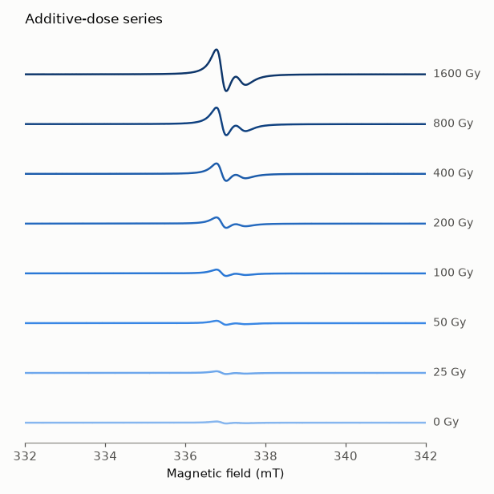
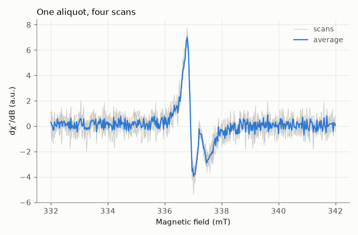
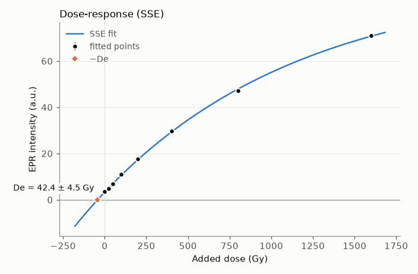
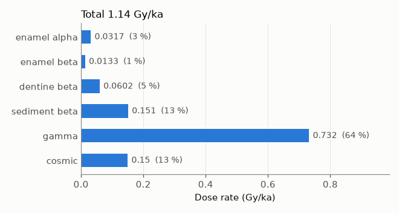
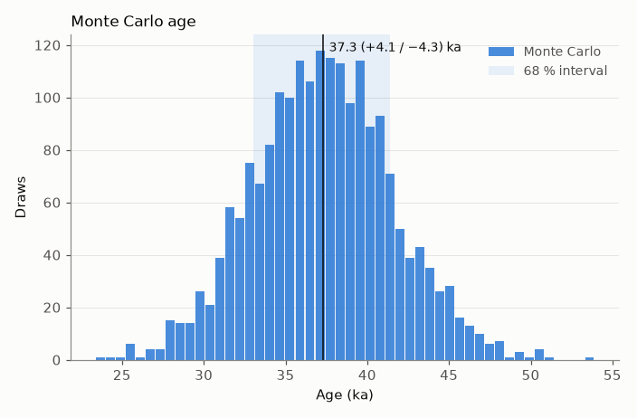
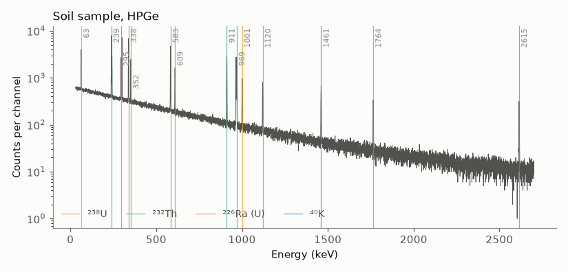
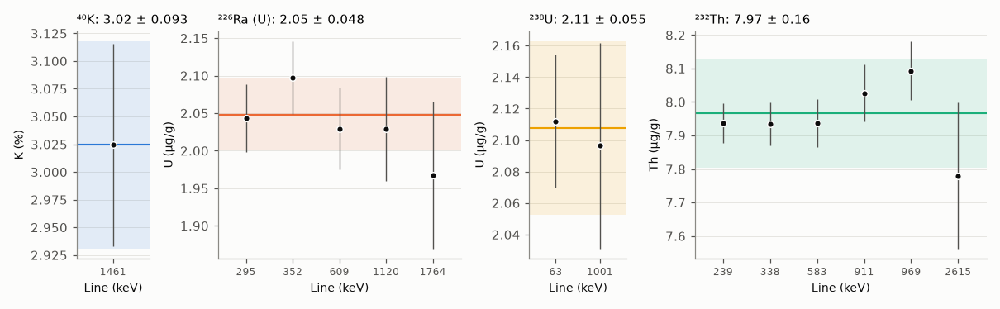

# Figures

`eprdating.plot` draws the standard figures of an ESR dating study. It
needs matplotlib (`pip install "eprdating[plot]"`).

Every function takes an optional `ax` and returns the axes, so figures can
be combined into panels and restyled with ordinary matplotlib calls:

```python
import matplotlib.pyplot as plt
from eprdating import plot

fig, (a, b) = plt.subplots(1, 2, figsize=(11, 4))
plot.plot_spectra(spectra, labels, ax=a)
plot.plot_dose_response(drc, ax=b)
fig.savefig("figure.pdf")
```

The figures below are generated from simulated data by
[`docs/make_figures.py`](make_figures.py).

## EPR spectra

### A dose series — `plot_spectra`

```python
plot.plot_spectra(spectra, ["0 Gy", "25 Gy", ...], window=(333, 341), fits=fits)
```

Stacked traces, light to dark with increasing dose. With `fits` (the results
of `ComponentBasis.fit`, or `(B, y)` pairs) the data are drawn in grey and the
fitted template in colour, which shows at a glance whether the template
follows every spectrum.



### One spectrum and its scans — `plot_spectrum`

```python
plot.plot_spectrum(spectrum, window=(330, 344), fit=result)
```

Individual scans in grey and their average: useful to spot a bad scan or a
baseline jump before averaging.



## Dose-response — `plot_dose_response`

```python
drc = fit_dose_response(doses, amplitudes, "SSE", sigma=errors)
plot.plot_dose_response(drc, excluded=[(100, 7.3, 8.4)])
```

Points with their errors, the fitted curve extrapolated to zero intensity,
and −De with its 1σ. Points left out of the fit (`excluded`) are drawn
hollow, so the figure documents the choice.



## Dose rate — `plot_dose_rate`

```python
plot.plot_dose_rate(sample.age())
```

Time-averaged contribution of each component at the age found (for U
uptake models this is not the present-day rate), with its share of the total.



## Age — `plot_age_distribution`

```python
plot.plot_age_distribution(sample.age_mc(n=5000), reference=(0.56, 2.44))
```

Monte Carlo ages with the median and the 68 % interval. `reference` draws a
range to compare with, such as an archaeological or radiocarbon age. Works
for `ToothSample.age_mc` and `USESRSample.age_mc`.



## Gamma spectrometry

### Spectrum and analysed lines — `plot_gamma_spectrum`

```python
plot.plot_gamma_spectrum(spectrum)       # after auto_calibrate(spectrum)
```



### Contents line by line — `plot_gamma_lines`

```python
r = analyse_files("soil.Spe", 600, refs, background="bg.Spe")
plot.plot_gamma_lines(r)
```

The content obtained from each gamma line, with the group mean ± 1σ. A line
that falls off its group points to an interference or to self-absorption;
the ²³⁸U panel against the ²²⁶Ra panel shows disequilibrium.



## Style

Series use a fixed colour order checked for colour-vision deficiencies,
ordered series (doses) a single blue ramp, text stays in neutral greys and
grids are hairlines. The constants (`plot.CATEGORICAL`, `plot.BLUE_RAMP`,
`plot.INK`…) can be changed before plotting.
