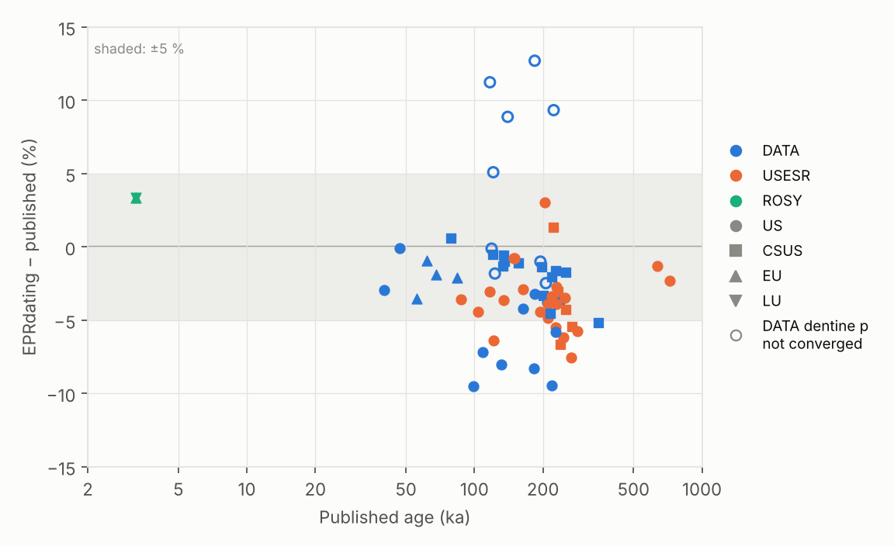

# Validation

What has been checked, against what, and where the details are. The tests
under `tests/validation` lock the agreement in; those that need external
files are skipped unless the files are available (see the end of this page).

## Dose rates and ages: ROSY 2.0

The original ROSY 2.0 program (Brennan et al. 1999) was run as a black box on
reference cases. Details: [`tests/validation/ROSY_FINDINGS.md`](../tests/validation/ROSY_FINDINGS.md).

| Piece | Agreement |
|---|---|
| Conversion factors (Adamiec & Aitken 1998), water correction | < 0.1 % |
| Cosmic dose rate | within 1 % |
| U-series ingrowth, radon loss | effective alpha efficiency predicted within −0.2 to +2.6 % |
| One-group beta attenuation (O'Brien et al. 1964, no fitted parameter) | dentine factors to three decimals; self-dose 1–2.5 %; sediment 2–5 % |
| Full ages, EU/LU/CU, 35 ka – 2 Ma, six real teeth of Brennan et al. (1997) | **−0.5 to +0.7 %** |
| Monte Carlo uncertainties vs ROSY's errors | within 25 % (geometry sampled) |

## Dose rates and ages: DATA

The original DATA program (Grün 2009) was run as a black box in DOSBox-X on
41 cases (82 EU/LU runs, 4 ka – 2.4 Ma). Details:
[`tests/validation/DATA_FINDINGS.md`](../tests/validation/DATA_FINDINGS.md).

| Piece | Agreement |
|---|---|
| Gamma + cosmic | −0.3 to +0.1 % |
| Internal dose rate | within ±2.7 % |
| Dentine beta factors | DATA's printed factors to the third decimal (±3 % at the extremes) |
| Dentine beta dose, one factor for the chain as in DATA | −1.4 to +5.7 % |
| Sediment beta dose | +7 to +13 % (mostly 40K; DATA's factors are below the one-group ones) |
| Ages with DATA's convention (`beta_by_segment=False`) | **−2.6 to +1.6 %**, mean −0.1 % |
| Ages with EPRdating's default (beta attenuated per U-series segment) | −7.5 to +1.1 %, mean −1.3 % |

DATA's U-series/ESR part was run on 40 more cases (230Th/234U 0.05–0.95,
ages 9 ka – 1.5 Ma):

| Piece | Agreement |
|---|---|
| US-ESR ages (29 regular cases) | −1.4 to +0.7 %, mean 0.0 % |
| Uptake parameter p, enamel and dentine | within 0.05 (2 % above p = 2), p from −0.8 to 16.7 |
| CS-US ages (Grün 2000) | within DATA's rounding to 1 ka plus 1 % |
| Monte Carlo uncertainties | within 5 % of DATA's errors |

DATA's own (age, p) reproduce the measured ratios in EPRdating's U-series
equations, so both programs use the same model. Three DATA limitations
appear:

- When the dentine took up its U much later than the enamel, DATA's dentine
  p does not converge. Its US-ESR ages are then up to 8 % too young.
- DATA gives no result for solutions with p below about −0.85.
- DATA prints CS-US ages younger than the uptake it assumes.

DATA ignores radon loss in this part.

DATA's input conventions: water as % of the wet mass, 234U/238U of the
incoming U, radon loss in the dentine only. By default EPRdating attenuates
the beta dose of each U-series segment separately, as ROSY does. For young
teeth this gives up to 40 % more dentine beta dose than DATA's single chain
factor; at 2 Ma the two agree. The campaign also exposed a bug, now fixed:
with sediment on both sides of the enamel, only one side was counted.

## Published ages from nine studies

Following DRAC's validation, 58 published tooth ages from nine studies were
recomputed from their published inputs. The studies used DATA, USESR or ROSY
and cover sites in South Africa, Thailand, Indonesia, France, Italy and
Colombia, with ages from 3 ka to 720 ka. Details:
[`tests/validation/PUBLISHED_FINDINGS.md`](../tests/validation/PUBLISHED_FINDINGS.md).



| | |
|---|---|
| EPRdating − published | −9.5 to +3.4 %, mean −3.2 % |
| Within 5 % | 44 of 58 |
| Within the published 1σ | 56 of 58 |

- The small systematic offset comes from the beta doses: EPRdating's are a
  few % higher than DATA's and USESR's. Internal and gamma doses agree.
- In Khok Sung (Duval et al. 2019) the published dentine p values do not
  reproduce the measured ratios when the dentine is much later than the
  enamel. This is DATA's convergence failure, and it makes those US-ESR ages
  5–13 % too young.
- Two sources were set aside: one prints a dentine U that its own dose rate
  contradicts, and one does not reproduce its own ages. Seven ROSY studies
  give too little information to recompute their ages.

## US-ESR: published ages

Shao et al. (2015) and Yu et al. (2026, De Nadale cave). Details:
[`tests/validation/USESR_FINDINGS.md`](../tests/validation/USESR_FINDINGS.md).

- The uptake parameter *p* at the published age is reproduced within 0.015
  (Shao) and 0.03 (De Nadale, ages rounded to 1 ka).
- Ages agree within the published 1σ; the remaining differences come from
  the beta attenuation of the USESR program, which differs from the
  one-group method.
- A sample at the closed-system U-series bound (CN-55) is flagged as
  marginal by the Monte Carlo instead of being given a spurious age.
- The alternative CSUS-ESR model (Grün 2000) passes a synthetic round trip
  and gives ages 3–4 % older than US-ESR for the De Nadale teeth.

## Gamma spectrometry

- **Independent analysis of the same spectra** (UNAL, HPGe 40 %, sediment
  and IAEA RGU-1/RGTh-1/RGK-1): K, U and Th within 1 %.
- **Spectra from other laboratories** (becquerel project: ORTEC PopTop in a
  lead cave and with a Marinelli beaker; Canberra Falcon 5000 and ORTEC
  Trans-SPEC in the field): the automatic calibration, without any first
  guess, places the 352, 1461 and 2615 keV peaks within 0.5 keV.
  Scintillator spectra (NaI, CsI) are rejected with a clear message.

## File readers

- **Bruker** files from EasySpin's test collection: the same measurement
  stored in two formats (BES3T and ESP; ESP and WinEPR; big and little
  endian) gives the same spectrum.
- **Gamma**: ORTEC `.Spe`, Canberra `.cnf`, ORTEC `.spc` and IEC 61455 files
  read identically to becquerel; N42 files from Sandia's SpecUtils are read
  with their counts, times and calibration.
- ORTEC `.Chn` is tested on files written to the ORTEC specification only.

## EPR intensities

- Template-fit errors by noise injection reproduce the scatter of repeated
  simulated measurements, including time-constant correlated noise and the
  field-shift search on weak signals.
- Pseudo-modulation reproduces the optimum modulation amplitude of a
  Lorentzian line (3.5 ΔBpp).

## Running the validation tests

```bash
pytest -m validation -rs
```

| Variable | Data |
|---|---|
| `EPRDATING_NORM_DATA` | UNAL NORM spectra (not public) |
| `EPRDATING_BQ_SAMPLES` | `tests/samples` of [becquerel](https://github.com/lbl-anp/becquerel) |
| `EPRDATING_EASYSPIN_FILES` | `tests/eprfiles` of [EasySpin](https://github.com/StollLab/EasySpin) |

The ROSY, DATA, US-ESR and published-study reference data are in the repository.
